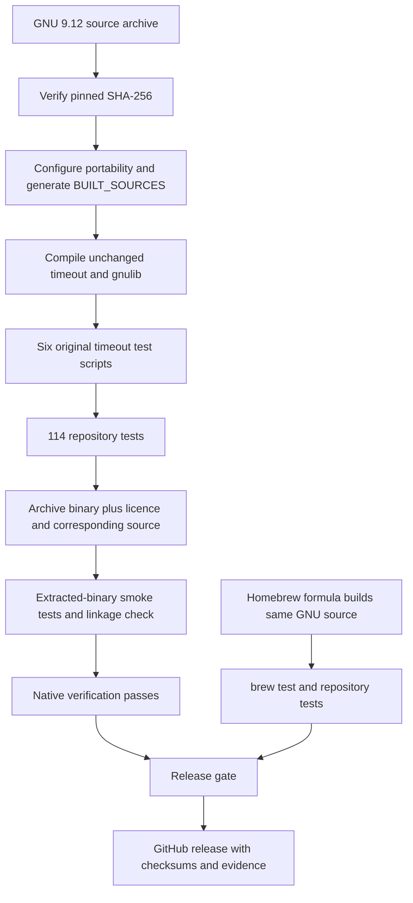
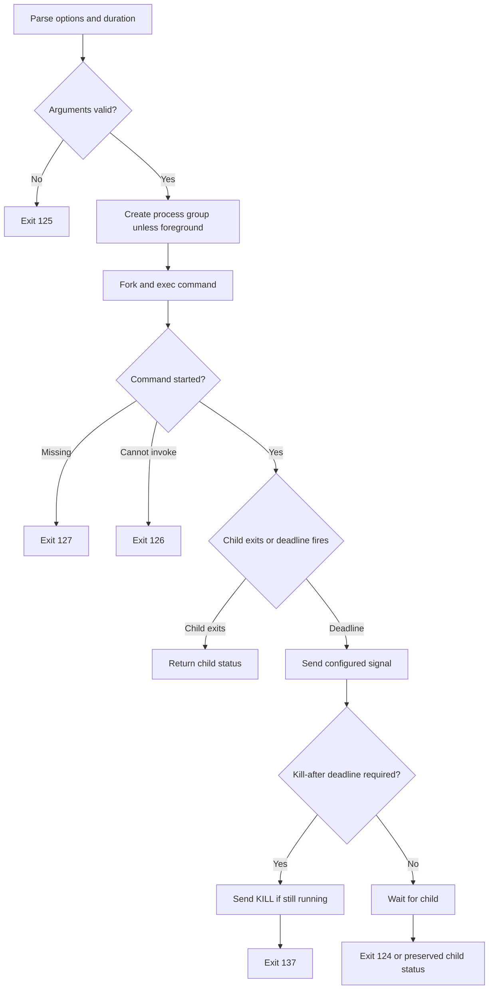

# Standalone build and behaviour

Journey: a Mac user installs the formula, runs `timeout -k 2s 10s command`, and
gets the same GNU option parsing and command exit contract. The timeout monitor
starts the command, sends TERM after ten seconds, and escalates to KILL after
two further seconds only if the monitored command is still running.

This is a conceptual flow. GNU also handles external signals, races and timer
failures in its unchanged implementation. `--foreground` signals the immediate
child; the default mode signals its process group. This CLI has no service state,
network API, background daemon, deployment controller or runtime telemetry.
